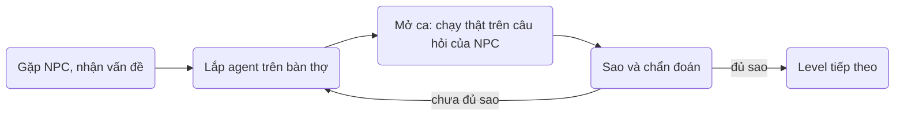
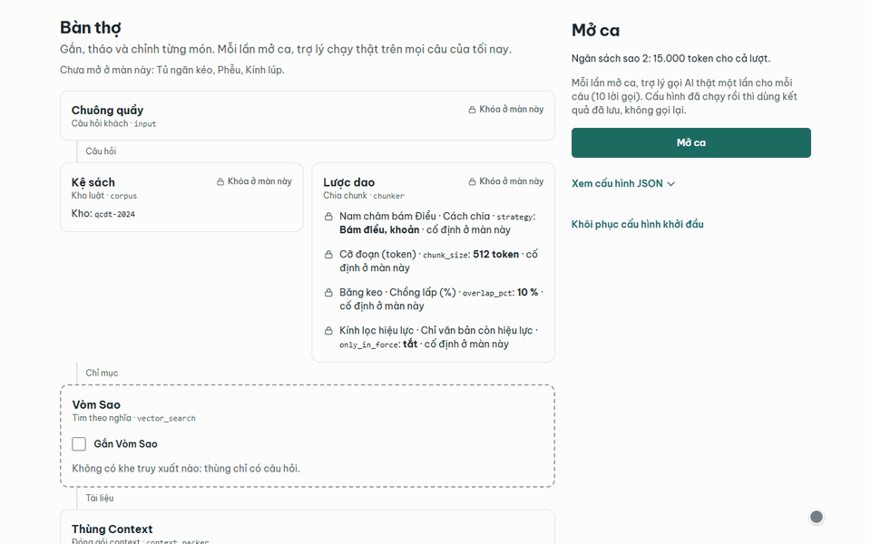
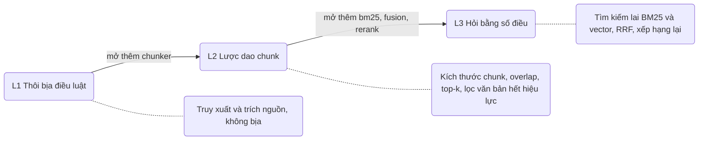
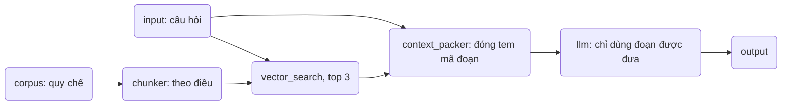
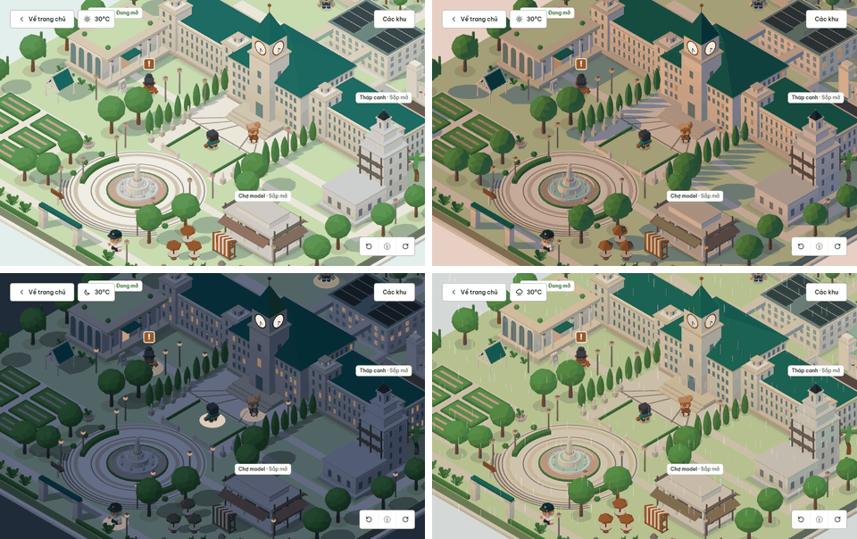
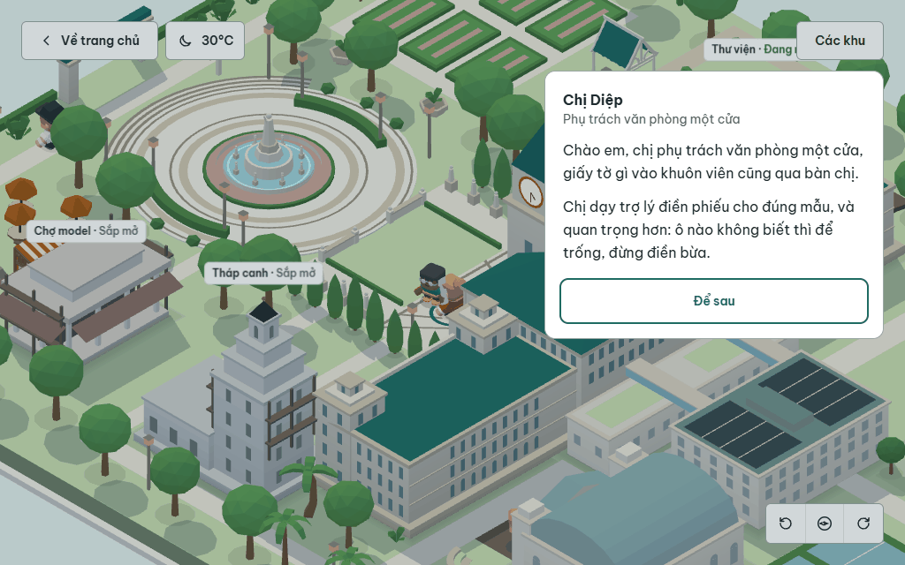
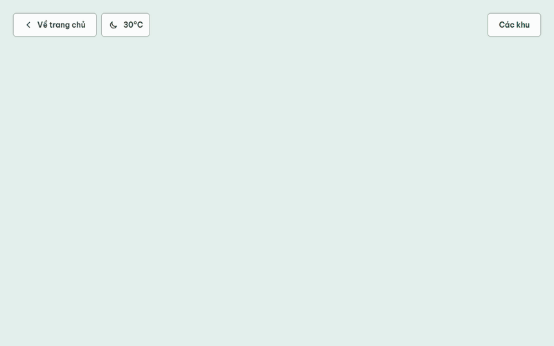
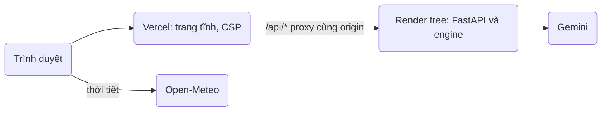
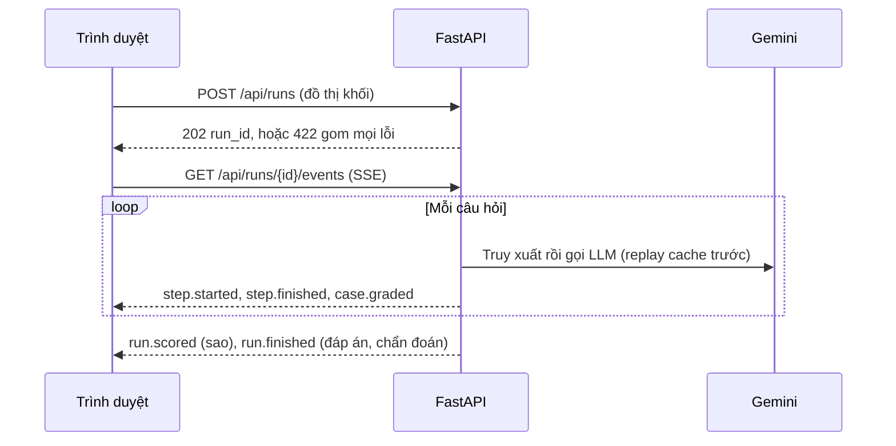

<p align="center">
  
</p>

<h1 align="center">V-Game</h1>

<p align="center">
  <strong>Lắp agent AI từ khối, chạy thật trên câu hỏi của NPC, rồi lần theo bằng chứng để hiểu vì sao agent đúng hay sai.</strong><br>
  Trò chơi học tập trên web cho chương trình AI 20K.
</p>

<p align="center">
  <a href="https://vgame.ai20k.cloud"><strong>Chơi ngay: vgame.ai20k.cloud</strong></a>
</p>

<p align="center">
  <a href="https://github.com/Tai-TZ/v-game/actions/workflows/ci.yml"></a>
  <a href="https://github.com/Tai-TZ/v-game/actions/workflows/security.yml"></a>
  <a href="https://vgame.ai20k.cloud"></a>
</p>

<p align="center">
  
</p>

> [!NOTE]
> API chạy trên gói miễn phí của Render và ngủ khi không có truy cập, nên lần mở đầu có thể chờ khoảng một phút.

## V-Game là gì

Người học đi trong một khuôn viên 3D thu nhỏ, gặp NPC và nhận một vấn đề có mục tiêu đo được. Họ lắp agent
trên bàn thợ (truy xuất, chia chunk, tìm kiếm lai, xếp hạng lại, gọi LLM), mở ca và xem agent chạy **thật**
trên bộ câu hỏi của NPC. Kết quả là số sao và lời chẩn đoán rút ra từ dấu vết của chính lượt chạy, không
phải đáp án mẫu.



| Sao | Điều kiện                                                        |
| --- | ---------------------------------------------------------------- |
| 1   | Đủ số câu thường đạt, gồm cả câu bắt buộc của level              |
| 2   | Có sao 1 và cả lượt chạy nằm trong ngân sách token của level     |
| 3   | Có sao 1, mọi câu bẫy đạt và không câu nào mắc lỗi cấm của level |

<p align="center">
  
  <br>
  <sub><b>Bàn thợ, level 1.</b> Lắp lời giải, mở ca, xem mười câu chạy trực tiếp qua SSE, rồi nhận sao, kết quả từng câu và chẩn đoán của cô Lan.</sub>
</p>

## Khu Thư viện

Khu đầu tiên dạy RAG trên một bộ quy chế đào tạo hư cấu (bản 2024 còn hiệu lực, bản 2019 đã hết hiệu lực).
Mỗi level có câu thấy được, câu ẩn và câu bẫy; agent phải trích đúng điều khoản từ văn bản gốc.



Lời giải mẫu của level 1 là một đồ thị khối như sau; đồ thị khởi đầu thiếu bước `vector_search`, nên agent
trả lời không nguồn hoặc bịa điều luật và nhận 0 sao, đúng bài học của level.



<table>
  <tr>
    <td width="60%" valign="top">
      
      <br><sub><b>Trang chủ dạy ngay một bài:</b> agent chưa có truy xuất bịa Điều 47; gắn truy xuất thì trả lời kèm nguồn.</sub>
    </td>
    <td width="40%" valign="top" align="center">
      
      <br><sub><b>Chạy trên điện thoại:</b> chạm để đi, kéo để xoay.</sub>
    </td>
  </tr>
</table>

## Hub khuôn viên

Đi bằng phím mũi tên, WASD, nhấp hoặc chạm; nhân vật tự tìm đường ngắn nhất, góc nhìn xoay 360°. Cô Lan và
bốn NPC hư cấu có lời thoại riêng. Ánh sáng theo giờ thật ở Hà Nội, trời theo thời tiết thật lấy từ
Open-Meteo. Trong lúc tải cảnh 3D, bản vẽ "Sa bàn đang dựng" nằm đúng chỗ sa bàn sẽ hiện.

<p align="center">
  
</p>

<table>
  <tr>
    <td width="50%" valign="top">
      
    </td>
    <td width="50%" valign="top">
      
    </td>
  </tr>
</table>

## Kiến trúc



Engine trên Render không nạp model nào: index, vector và điểm rerank đóng gói sẵn trong code. Đồ thị khởi
đầu và lời giải mẫu phát lại câu trả lời Gemini đã lưu; cấu hình khác gọi Gemini thật trong trần lời gọi
mỗi ngày. Thời tiết do trình duyệt người xem lấy thẳng từ Open-Meteo.

### Một lượt chạy



Đáp án chỉ xuất hiện trong `run.finished`. Hợp đồng sự kiện đầy đủ: [engine-v0.2.md](docs/design/engine-v0.2.md).

### Công nghệ

| Tầng              | Công nghệ                                                                                                    |
| ----------------- | ------------------------------------------------------------------------------------------------------------ |
| Giao diện         | React 19, React Router 8 (SPA, trang chủ pre-render), Vite 8, TypeScript 6 strict, Tailwind CSS 4, Zustand 5 |
| Cảnh 3D           | three.js 0.186 qua react-three-fiber 9; model CC0 nướng sẵn, ánh sáng nướng vào vertex color                 |
| API và engine     | Python 3.12, FastAPI, LangGraph 1.2, Gemini qua `google-genai`, BM25, KNN cosine bằng numpy                  |
| Kiểm thử          | Vitest, Playwright và axe-core, pytest, ruff, mypy strict                                                    |
| Deploy và bảo mật | Vercel, Render Blueprint, GitHub Actions, gitleaks, semgrep, osv-scanner                                     |

### Ngân sách hiệu năng

Mục tiêu 60 FPS trên laptop GPU tích hợp; build hoặc test thất bại khi vượt ngân sách.

| Hạng mục                 | Ngân sách     | Hiện tại |
| ------------------------ | ------------- | -------- |
| Draw call trong cảnh hub | ≤ 40          | 18       |
| Tam giác trong cảnh hub  | ≤ 60.000      | ~31.000  |
| Chunk route `/play`      | ≤ 300 kB gzip | ~293 kB  |
| three.js trên trang chủ  | 0 chunk       | 0        |
| Khung hình khi đứng yên  | 0             | 0        |

## Chạy local

Cần Node ≥ 22.22, Python 3.12, [uv](https://docs.astral.sh/uv/) và một khoá Gemini API. Không cần dựng
index: dữ liệu truy xuất đã đi kèm code.

```bash
# terminal 1: backend
cd backend
uv sync
cp .env.example .env    # điền GEMINI_API_KEY; .env không bao giờ được commit
uv run uvicorn --factory vgame.main:create_app --reload --port 8000

# terminal 2: frontend
cd frontend
npm ci
npm run dev             # http://localhost:5173/play, /api proxy sang :8000
```

| Lệnh                                                          | Ở đâu       | Làm gì                                             |
| ------------------------------------------------------------- | ----------- | -------------------------------------------------- |
| `npm run check && npm run build && npm run test:e2e`          | `frontend/` | Format, lint, type, unit, build kèm ngân sách, e2e |
| `uv run ruff check && uv run mypy src tests && uv run pytest` | `backend/`  | Lint, type, test offline với LLM giả               |
| `lefthook install`                                            | gốc repo    | Git hook: gitleaks và lint file đã stage           |

## Trạng thái và lộ trình

- [x] Khu Thư viện: ba level L1–L3 chơi trọn trên bàn thợ, có sao và chẩn đoán
- [x] Hub v0.4: xoay 360°, NPC, props CC0, thời tiết và giờ thật, màn chờ "Sa bàn đang dựng"
- [x] Engine không nạp model chạy trên Render free, production ở <https://vgame.ai20k.cloud>
- [ ] Bàn thợ đợt B: bước đoán kết quả, gợi ý, mở khoá level theo sao
- [ ] Khu Tháp canh (guardrails) và Chợ model (token, context, chọn model)
- [ ] Bài học ngắn của NPC, chờ duyệt nội dung

## Tài liệu

| Tài liệu                                                   | Nội dung                                          |
| ---------------------------------------------------------- | ------------------------------------------------- |
| [docs/README.md](docs/README.md)                           | Mục lục toàn bộ tài liệu                          |
| [Đặc tả tổng hợp](docs/specs/2026-10-07-v-game-design.md)  | Mục tiêu, vòng chơi, kiến trúc, phạm vi           |
| [Lộ trình v0.4](docs/design/roadmap-v0.4.md)               | Quyết định mới nhất, kế hoạch đợt B               |
| [Engine v0.2](docs/design/engine-v0.2.md)                  | Khối, validate, biên dịch, sự kiện SSE, chấm điểm |
| [Kiến trúc frontend](docs/design/frontend-architecture.md) | Module, luồng dữ liệu, ngân sách                  |
| [Deploy](docs/deploy.md)                                   | Vercel, Render, tên miền, CI/CD                   |
| [backend/README.md](backend/README.md)                     | Endpoint, mã lỗi, biến môi trường                 |
| [frontend/README.md](frontend/README.md)                   | Route, lệnh, quy tắc frontend                     |

---

<sub>Quy chế đào tạo, trường đại học và mọi nhân vật đều là hư cấu. Bản công khai và mọi hình trong README dùng theme town.</sub>

<sub>Model 3D: Kenney và Quaternius, CC0 1.0. Dữ liệu thời tiết: <a href="https://open-meteo.com/">Open-Meteo</a>, CC BY 4.0. Chi tiết ở <a href="CREDITS.md">CREDITS.md</a>.</sub>

<p align="center"><sub>Thực hiện bởi Tai Thanh Nguyen</sub></p>
