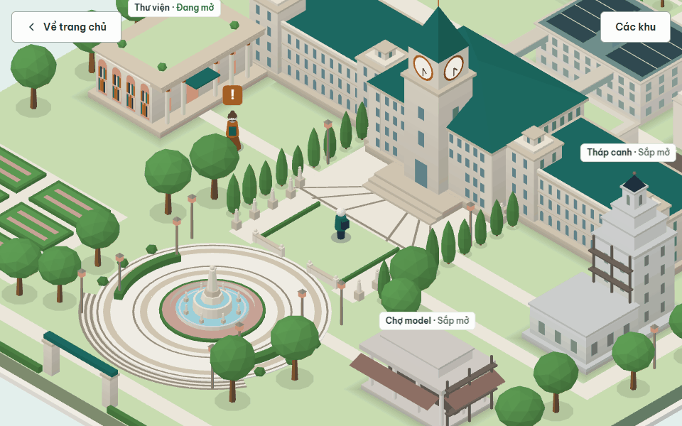
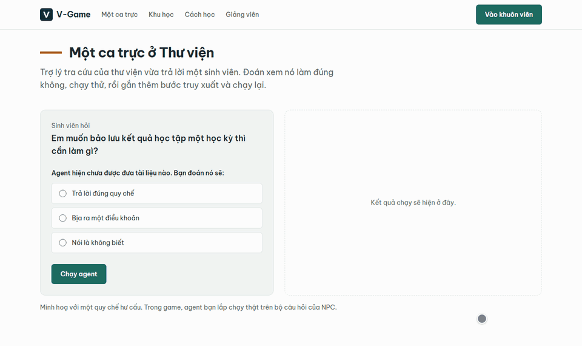
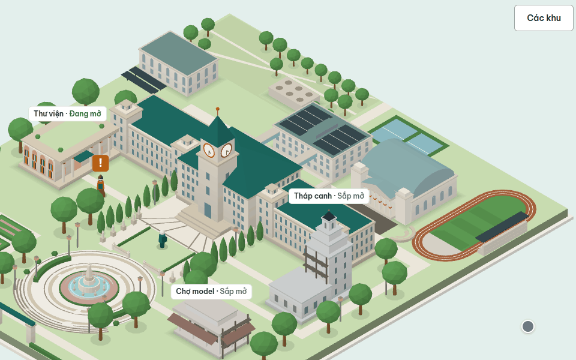
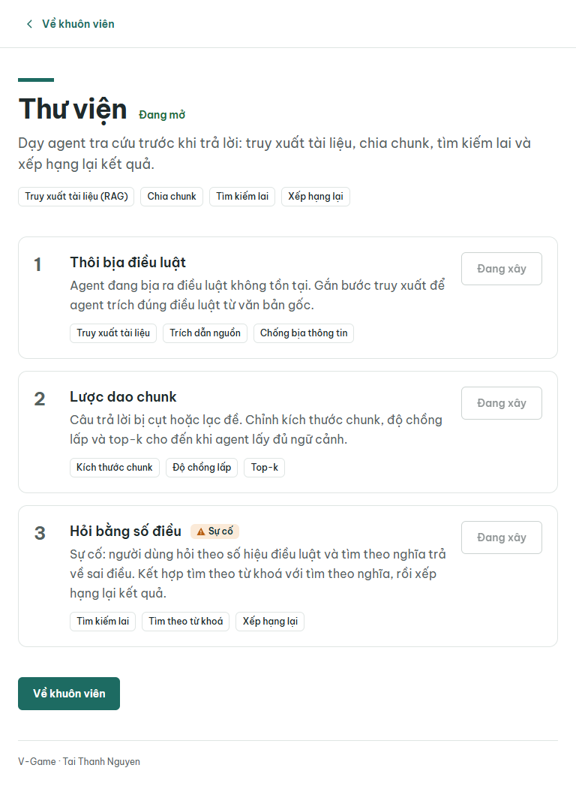
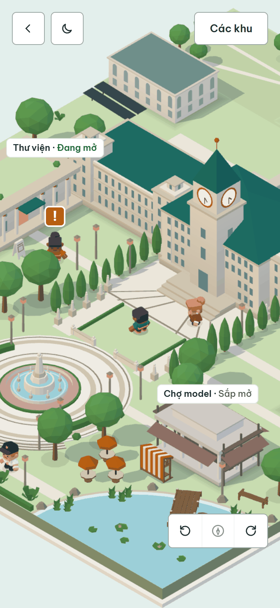
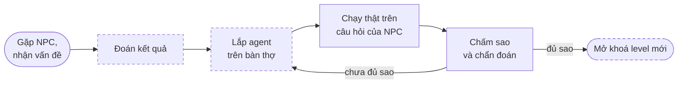
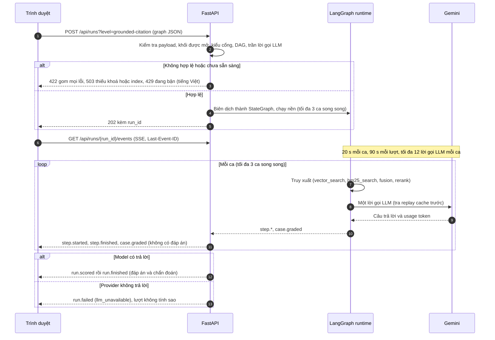
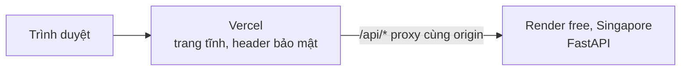

<p align="center">
  
</p>

<h1 align="center">V-Game</h1>

<p align="center">
  <strong>Lắp agent AI từ khối, chạy thật trên câu hỏi của NPC, rồi lần theo bằng chứng để hiểu vì sao agent đúng hay sai.</strong><br>
  Trò chơi học tập trên web cho chương trình AI 20K.
</p>

<p align="center">
  <a href="https://github.com/Tai-TZ/v-game/actions/workflows/ci.yml"></a>
  <a href="https://github.com/Tai-TZ/v-game/actions/workflows/security.yml"></a>
  <a href="https://v-game-theta.vercel.app"></a>
  <br>
  
  
  
  
  
</p>

<p align="center">
  <a href="#bản-chạy-thử">Bản chạy thử</a> ·
  <a href="#vòng-chơi">Vòng chơi</a> ·
  <a href="#chạy-local">Chạy local</a> ·
  <a href="#trạng-thái-và-lộ-trình">Lộ trình</a> ·
  <a href="#một-lượt-chạy-diễn-ra-thế-nào">Một lượt chạy</a> ·
  <a href="#kỹ-thuật">Kỹ thuật</a> ·
  <a href="docs/README.md">Tài liệu</a>
</p>

<p align="center">
  
  <br>
  <sub>Hub khuôn viên: đi bằng phím mũi tên, WASD, nhấp hoặc chạm; camera bám theo, cảnh chỉ vẽ lại khi có chuyển động.</sub>
</p>

## V-Game là gì

V-Game biến bài học AI thành các ca trực trong một khuôn viên 3D thu nhỏ. Người học gặp NPC, nhận một
vấn đề có mục tiêu đo được, lắp agent từ các khối (truy xuất, chia chunk, tìm kiếm lai, xếp hạng lại,
gọi LLM) rồi chạy agent đó **thật** trên bộ câu hỏi của NPC. Kết quả là số sao và lời chẩn đoán rút ra
từ dấu vết của chính lượt chạy, không phải đáp án mẫu.

- **Chạy thật, không mô phỏng.** Backend biên dịch khối thành đồ thị LangGraph, gọi Gemini và phát từng bước qua SSE.
- **Chấm theo bằng chứng.** Chẩn đoán chỉ ra bước gây lỗi từ dấu vết của lượt chạy; bộ câu hỏi có câu ẩn và câu bẫy, đáp án chỉ hiện khi lượt chạy kết thúc.
- **Một sa bàn đi bộ được.** Cổng ở mép trước, ba khu chơi quanh quảng trường, khuôn viên phía sau nhà chính có hội trường mái vòm, sân tennis và sân vận động. Nhấp vào đâu, nhân vật tự tìm đường ngắn nhất tới đó.
- **Giờ thật và thời tiết hôm nay.** Sa bàn sáng, chiều, tối theo mặt trời ở Hà Nội (tính ngay trong trình duyệt) và đổi theo thời tiết thật (mưa, sương, dông) trình duyệt lấy thẳng từ Open-Meteo. Chip trên góc trái có chế độ "Cố định ban ngày" cho máy chiếu.
- **Nhẹ.** Cả cảnh hub chỉ 13 draw call; three.js chỉ tải ở `/play`.

> [!NOTE]
> Engine và API ở bản **v0.2**, hub ở bản **v0.3**: ba level của khu Thư viện chạy được qua API; trang chủ,
> hub 3D và trang khu đã xong và đã có bản chạy thử công khai. **Bàn thợ (lắp khối ngay trong trình duyệt)
> chưa có**: hiện agent chỉ gửi được dưới dạng graph JSON qua API. Xem
> [Trạng thái và lộ trình](#trạng-thái-và-lộ-trình).

## Bản chạy thử

**<https://v-game-theta.vercel.app>** đang chạy, chỉ với theme town; địa chỉ chính thức sẽ là
`vgame.ai20k.cloud` khi tên miền được trỏ xong. API nằm ở gói miễn phí và ngủ khi không có truy cập, nên
lần mở đầu có thể chờ khoảng một phút. Bản này có trang chủ, hub 3D và trang khu với dữ liệu thật; chưa
chạy được agent. Cách deploy: [Kỹ thuật › Deploy](#deploy).

## Xem nhanh

<p align="center">
  
  <br>
  <sub><b>Trang chủ dạy ngay một bài.</b> Chọn dự đoán "Bịa ra một điều khoản", chạy agent chưa có truy xuất và nhận một điều khoản bịa (Điều 47), rồi gắn bước truy xuất, chạy lại và nhận câu trả lời kèm nguồn (Điều 12, khoản 2). Đây là minh hoạ cố định, không gọi model.</sub>
</p>

<p align="center">
  
  <br>
  <sub><b>Ra khuôn viên phía sau.</b> Hàng "Đi tới khuôn viên phía sau" trong danh sách "Các khu" cho nhân vật tự đi vòng nhà chính, từ giữa cảnh tới đường chạy bên phải, theo đường ngắn nhất tránh mọi vật cản; nhấp chuột lên cảnh dùng cùng cách tìm đường.</sub>
</p>

<table>
  <tr>
    <td width="50%" valign="top">
      
      <br><sub><b>Trang khu.</b> Ba level của Thư viện; level cuối là sự cố làm vỡ lời giải của level trước.</sub>
    </td>
    <td width="50%" valign="top" align="center">
      
      <br><sub><b>Chạy trên điện thoại.</b> Chạm để đi, không tràn ngang ở 375 px.</sub>
    </td>
  </tr>
</table>

## Vòng chơi



<sub>Nét đứt: phần giao diện chưa có. Chạy thật, chấm sao và chẩn đoán đã hoạt động qua API.</sub>

| Sao | Điều kiện |
|---|---|
| Sao 1 | Đủ số câu thường đạt, gồm cả câu bắt buộc của level |
| Sao 2 | Có sao 1 và cả lượt chạy nằm trong ngân sách token của level |
| Sao 3 | Có sao 1, mọi câu bẫy đạt và không câu nào mắc lỗi cấm của level (level 1: trích nguồn bịa; level 2: đưa văn bản hết hiệu lực vào context) |

## Khu Thư viện

Khu đầu tiên dạy RAG trên một bộ quy chế đào tạo hư cấu (bản 2024 còn hiệu lực, bản 2019 đã hết hiệu
lực). Mỗi level có câu thấy được, câu ẩn và câu bẫy; agent của người chơi phải trích đúng điều khoản từ
văn bản gốc.

| # | Level | Bài học | Khối được dùng |
|---|---|---|---|
| 1 | Thôi bịa điều luật | Gắn truy xuất, trích dẫn nguồn, không bịa | `vector_search`, `context_packer`, `llm`; cách chia chunk cố định |
| 2 | Lược dao chunk | Kích thước chunk, độ chồng lấp, top-k, ngưỡng điểm, lọc văn bản hết hiệu lực | như level 1, chỉnh được `chunker` |
| 3 | Hỏi bằng số điều *(sự cố)* | Tìm theo nghĩa trượt khi hỏi theo số điều: thêm BM25, hợp nhất bằng RRF hoặc trọng số alpha, xếp hạng lại | thêm `bm25_search`, `fusion`, `rerank` |

Đo với model thật ngày 2026-10-08: lời giải mẫu level 1 đạt **3 sao** với **10.262 token**
(`gemini-3.5-flash-lite`); chạy lại cùng đồ thị thì câu trả lời lấy từ replay cache, không tốn thêm lời
gọi nào. Ngân sách sao 2 của từng level đang được hiệu chỉnh lại theo lượt chạy lời giải mẫu với Gemini
thật; số hiện hành nằm trong file level (`backend/src/vgame/engine/levels/`) và
[báo cáo spike](docs/design/engine-spike-report.md).

## Chạy local

Cần Node ≥ 22.22, Python 3.12, [uv](https://docs.astral.sh/uv/); khoá Gemini API để chạy agent thật.

**Backend** (terminal 1):

```bash
cd backend
uv sync
cp .env.example .env          # rồi điền khoá vào backend/.env, xem bên dưới
uv run vgame-build-index      # chạy một lần: tải model embedding (~2,2 GB) và reranker, dựng 24 biến thể index
uv run uvicorn --factory vgame.main:create_app --reload --port 8000
```

```dotenv
# backend/.env (đã có trong .gitignore, không commit)
GEMINI_API_KEY=<khoá-gemini-của-bạn>
# Model đã đo trong báo cáo spike; đổi model thì cần kiểm lại ngân sách sao 2.
GEMINI_MODEL=gemini-3.5-flash-lite
```

**Frontend** (terminal 2):

```bash
cd frontend
npm ci
npm run dev                   # http://localhost:5173, /api được proxy sang 127.0.0.1:8000
```

Mở <http://localhost:5173/play> để vào hub. Tài liệu API (tắt khi `ENV=production`):
<http://localhost:8000/docs>. Thiếu khoá hoặc index thì app vẫn chạy: các trang và API khu, level, khối
hoạt động bình thường, còn `POST /api/runs` trả `503` kèm thông báo tiếng Việt.

<details>
<summary><b>Thử một lượt chạy qua API</b> (khi chưa có bàn thợ)</summary>

Gửi đồ thị khởi đầu của level 1. Đồ thị này chưa có bước truy xuất nên thường trả lời không có nguồn
hoặc bịa điều luật, và nhận 0 sao, đúng như bài học của level. Lần chạy đầu tốn khoảng 10 lời gọi Gemini, tính vào `DAILY_LLM_CALL_CAP`.
Chạy trong bash hoặc Git Bash (trong PowerShell 5.1, `curl` là `Invoke-WebRequest`); cần `curl` và `jq`.

```bash
curl -s http://localhost:8000/api/levels/grounded-citation | jq .starter_graph > graph.json
curl -s -X POST "http://localhost:8000/api/runs?level=grounded-citation" \
  -H "Content-Type: application/json" --data @graph.json        # trả về {"run_id": ...}
curl -N http://localhost:8000/api/runs/<run_id>/events          # luồng SSE tới run.finished
```

Danh sách endpoint, mã lỗi và biến môi trường: [backend/README.md](backend/README.md).

</details>

## Trạng thái và lộ trình

- [x] Engine v0.2: 10 khối, validate gom lỗi, biên dịch LangGraph, chạy song song, chấm sao, chẩn đoán
- [x] API: khu, level, khối, lượt chạy (SSE phát lại theo `Last-Event-ID`, idempotency, huỷ)
- [x] Ba level Thư viện chạy được từ đầu tới cuối; lời giải mẫu level 1 đạt 3 sao với Gemini thật
- [x] Trang chủ pre-render, hub 3D, trang khu, hai theme pack
- [x] Hub v0.3: cổng ở mép trước, khuôn viên phía sau nhà chính, nhấp để đi theo đường ngắn nhất
- [x] Bản chạy thử công khai: Vercel cho frontend, Render free cho API, chỉ theme town
- [ ] Bàn thợ: lắp khối và chạy agent ngay trong trình duyệt
- [ ] Bước đoán kết quả trong game; lưu tiến trình và mở khoá level
- [ ] Màn kết quả: tiến trình từng bước, sao, chẩn đoán, ba gợi ý tăng dần
- [ ] Chạy agent trên bản deploy: chỗ chạy index truy xuất và reranker (gói free không đủ RAM)
- [ ] Chốt nội dung và ngân sách token của level 2, 3 qua thêm lượt chạy với model thật
- [ ] Tháp canh (guardrails) và Chợ model (token, context, chọn model)
- [ ] Lưu bền và giám sát theo [ADR 0003](docs/adr/0003-backend-stack.md): PostgreSQL/pgvector, Redis, Langfuse; đăng nhập và vai trò giáo viên

Thứ tự tiếp theo: dựng bàn thợ và chỗ chạy agent cho bản chạy thử để giảng viên chơi trọn khu Thư viện →
mở rộng tới MVP 3 khu × 3 level → pilot với một lớp, đo trước và sau → đề xuất đưa vào toàn chương trình.

## Một lượt chạy diễn ra thế nào

Mỗi câu hỏi của NPC chạy thành một **ca**: ca đi qua đồ thị của người chơi và được chấm riêng.



<details>
<summary><b>Các sự kiện SSE</b></summary>

| Sự kiện | Mang theo |
|---|---|
| `run.started` | các ca (chỉ ca của câu thấy được mới kèm nội dung câu hỏi), thống kê index của mỗi `chunker` |
| `step.started` / `step.finished` | luôn đi cặp; `status` là `ok`, `timeout`, `cancelled`, `budget`, `llm_error` hoặc `refusal`; tóm tắt ≤ 140 ký tự, token, ms, dữ kiện trung tính |
| `case.graded` | đạt hay trượt, tiêu chí, nhãn không cần đáp án (`cite_unknown`, `cite_missing`, `stale_doc`…) |
| `run.scored` | số sao 0–3, cờ s1–s3, số câu thường và câu bẫy đạt, token so với ngân sách |
| `run.finished` | đáp án và chẩn đoán bằng tiếng Việt; đây là chỗ duy nhất đáp án xuất hiện |
| `run.failed` | `index_missing`, `rerank_unavailable`, `llm_not_configured`, `cancelled`, `internal` hoặc `llm_unavailable` (thay cho cả `run.scored` và `run.finished`) |

Client mất kết nối thì gửi `Last-Event-ID: n` để nhận lại mọi sự kiện sau `n`. Hợp đồng đầy đủ:
[engine-v0.2.md](docs/design/engine-v0.2.md) §8.

</details>

## Kỹ thuật

### Công nghệ

| Tầng | Công nghệ |
|---|---|
| Giao diện | React 19, React Router 8 (framework mode, `ssr: false`, trang chủ pre-render), Vite 8, TypeScript 6 strict, Tailwind CSS 4 (chỉ token ngữ nghĩa), Zustand 5, Valibot |
| Cảnh 3D | three.js 0.186 qua `@react-three/fiber` 9; hình procedural, ánh sáng nướng vào vertex color, không texture, không shadow map; tìm đường bằng đồ thị tầm nhìn quanh vật cản |
| API | Python 3.12, FastAPI 0.142, Pydantic 2, quản lý bằng uv |
| Engine agent | LangGraph 1.2 (`StateGraph` tĩnh); Gemini qua `google-genai` sau cổng `LLMClient` không phụ thuộc nhà cung cấp; replay cache sqlite |
| Truy xuất | fastembed với `multilingual-e5-large` (embedding) và `jina-reranker-v2-base-multilingual` (rerank, giấy phép CC-BY-NC-4.0); `rank-bm25`; KNN cosine chính xác bằng numpy |
| Kiểm thử và lint | Vitest, Testing Library, Playwright và axe-core, pytest, ruff, mypy strict |
| Deploy | Vercel (Build Output API, `scripts/build-vercel.mjs`), Render Blueprint (`render.yaml`) |
| CI và bảo mật | GitHub Actions, gitleaks, semgrep, osv-scanner, lefthook |

### Hiệu năng

Mục tiêu là 60 FPS trên laptop dùng GPU tích hợp. Các ngân sách dưới đây có kiểm tra tự động, build hoặc
test thất bại khi bị vượt.

| Hạng mục | Ngân sách | Đo được | Kiểm tra |
|---|---|---|---|
| Draw call trong cảnh hub | ≤ 40 | **13** | `scene.test.ts`, thất bại nếu > 16 |
| Tam giác trong cảnh hub | ≤ 60.000 | **16.186** (theme town) · **19.248** (theme campus) | `scene.test.ts`, thất bại nếu > 23.000 |
| Chunk riêng của route `/play` (three, r3f, scene) ¹ | ≤ 300 kB gzip | **292,8 kB** | `scripts/check-bundle.mjs` trong `npm run build` |
| three.js trên trang chủ | 0 chunk | **0** | `check-bundle.mjs` và `e2e/landing.spec.ts` |
| Khung hình khi đứng yên | 0 | **0** (`frameloop="demand"`) | `e2e/play.spec.ts` với `?debug=frames` |

<sub>¹ Tải nguội <code>/play</code> khoảng 380 kB gzip, gồm shell khoảng 115 kB. CI render WebGL bằng SwiftShader nên FPS thật được đo tay. Số đo cảnh lấy từ <code>sceneBudget()</code> sau bản cảnh v0.3 (sa bàn có khuôn viên phía sau).</sub>

**Số đo engine** (đo tay, 2026-10-08):

| Hạng mục | Đo được |
|---|---|
| Dựng index (một lần) | tải `multilingual-e5-large` (~2,2 GB) và reranker; 24 biến thể chia chunk, artifact 11,7 MB |
| Một lượt level 1, lời giải mẫu | **10.262 token**, 3 sao; mỗi ca p50 1,28 s, p95 3,08 s (`gemini-3.5-flash-lite`) |

<sub>Nguồn: <a href="docs/design/engine-spike-report.md">báo cáo spike</a>.</sub>

### Theme pack

Theme pack chỉ là dữ liệu trong `frontend/public/themes/<id>/` (manifest, CSS token, font, ảnh), liệt kê
ở `index.json`; theme không dùng thì không bị tải.

- `VITE_THEME_PACKS` chọn các theme được đóng gói (bản công khai: chỉ `town`); không đặt thì lấy mọi theme trong `index.json`.
- `VITE_DEFAULT_THEME` chọn theme mặc định; không đặt thì lấy theme đầu tiên.
- Khi bản build có từ hai theme, nút trên thanh trên cùng cho đổi theme mà không tải lại trang; lựa chọn được nhớ trong `localStorage` (`vg-theme`).
- Thêm theme: thêm một thư mục và một dòng trong `index.json`. Bỏ theme: xoá cả hai. Không cần sửa code.
- Mỗi manifest có `place` (tên, toạ độ, múi giờ) và bốn preset ánh sáng (`dawn`, `day`, `dusk`, `night`); `theme.css` khai màu trời của từng pha và trời mây. Thời tiết lấy theo toạ độ `place`. Không bao giờ dùng vị trí người xem.
- Code app và backend không nhắc tên thương hiệu; job Brand isolation của CI kiểm tra điều này.

### Deploy



| Phần | Nơi chạy | Ghi chú |
|---|---|---|
| Frontend | Vercel, thư mục gốc `frontend`, lệnh `npm run build:vercel` | Chỉ đóng gói theme town. CSP theo hash của từng bản build, SPA fallback, `/api/*` chuyển tiếp phía máy chủ nên không cần CORS |
| API | Render gói free, vùng Singapore, khai báo trong [`render.yaml`](render.yaml) | 512 MB RAM, health check `/api/health`. Ngủ sau 15 phút không có truy cập; lần mở đầu có thể chờ khoảng một phút, trang chủ tự gọi `/api/health` để đánh thức sớm |

Merge vào `main` thì Vercel tự deploy lại; Render chỉ deploy khi CI xanh và `backend/`, `docs/content/`
hoặc `render.yaml` đổi, để API giữ ở mức 0 đồng. Chưa chạy agent trên bản deploy: ngoài việc chưa có bàn
thợ, index truy xuất và model embedding (khoảng 2,2 GB) không vừa gói free. Từng bước dựng lại, biến môi
trường và tên miền: [docs/deploy.md](docs/deploy.md).

### Chất lượng và bảo mật

```bash
# trong frontend/ (lần đầu: npx playwright install chromium)
npm run check && npm run build && npm run test:e2e
```

```bash
# trong backend/
uv run ruff check && uv run ruff format --check && uv run mypy src tests && uv run pytest
```

`uv run pytest` chạy offline với model giả và LLM giả. `uv run pytest -m slow` dùng model thật, cần dựng
index trước. Git hook (gitleaks và lint file đã stage): chạy `lefthook install` sau mỗi lần clone.

| Workflow | Job | Kiểm tra |
|---|---|---|
| CI | Frontend checks | Prettier, ESLint, typecheck, Vitest, build kèm ngân sách bundle và CSP |
| CI | Backend checks | `uv sync --locked`, ruff, mypy strict, pytest |
| CI | End-to-end tests | Playwright trên bản build production, desktop và Pixel 7, WebGL phần mềm, axe |
| CI | Brand isolation | Không có tên thương hiệu trong `frontend/app`, `backend/src`, `backend/tests` |
| Security | Secret scan (gitleaks) | Quét secret trên toàn bộ lịch sử git |
| Security | SAST (semgrep) | Bộ luật `p/default`, image ghim theo digest |
| Security | Dependency vulnerabilities (osv-scanner) | Lỗ hổng trong `package-lock.json` và `uv.lock` |

Workflow Security chạy ở mỗi push lên main, mỗi PR và 03:23 UTC mỗi thứ Hai.

<details>
<summary><b>Các biện pháp bảo mật</b></summary>

- **CSP chặt.** Bản build tĩnh sinh header với `default-src 'self'`, `script-src 'self'` cộng hash của
  từng script inline, `style-src 'self'` (HTML pre-render không có thuộc tính `style`), kèm HSTS,
  `nosniff`, `Referrer-Policy` và `Permissions-Policy`. Backend gắn header bảo mật cho mọi phản hồi.
- **Một origin cho API.** Trên bản chạy thử, trình duyệt chỉ gọi `/api/*` của chính trang; Vercel chuyển
  tiếp sang Render phía máy chủ, nên backend không phải mở CORS. `connect-src` chỉ thêm
  `https://api.open-meteo.com` cho thời tiết khuôn viên.
- **Đầu vào của người chơi là dữ liệu.** Không chạy code của người chơi; payload ≤ 64 KB, chuẩn hoá NFC,
  chặn NUL và ký tự bidi; khối phải nằm trong danh sách được mở; chữ không bao giờ đi qua `str.format`.
- **Đáp án không rò.** Đáp án chỉ có trong `run.finished`; nội dung câu ẩn và câu bẫy không xuất hiện
  trong sự kiện nào; lỗi không kèm stack trace.
- **Chi phí LLM có trần.** Tối đa 12 lời gọi mỗi ca, `DAILY_LLM_CALL_CAP` (mặc định 500 lời gọi mỗi ngày
  cho cả server), `MAX_CONCURRENT_RUNS` (mặc định 1).
- **Chuỗi cung ứng.** Action ghim theo commit SHA, `permissions: contents: read`, binary gitleaks và
  osv-scanner được kiểm checksum; `.env` nằm trong `.gitignore`; khoá Gemini trên Render chỉ đặt trong
  tab Environment, không nằm trong git.

</details>

### Cấu trúc dự án

<details>
<summary><b>Cây thư mục</b></summary>

```text
v-game/
├── frontend/                  React Router 8 SPA và cảnh 3D
│   ├── app/
│   │   ├── routes/            home (pre-render), play (hub), play-zone, not-found
│   │   └── features/
│   │       ├── campus/        layout (vật cản, tìm đường), movement, camera, store; hud/; scene/ (three.js, tải lười)
│   │       ├── landing/       các mục của trang chủ, gồm ShiftDemo
│   │       ├── theme/         đọc theme pack, ThemeProvider, ThemeToggle
│   │       └── zones/         schema (valibot), API, trang khu
│   ├── public/themes/         theme pack: chỉ dữ liệu (manifest, CSS token, font, ảnh)
│   ├── e2e/                   Playwright: landing, play, play-zone, a11y, qa-regressions
│   ├── scripts/               check-bundle, postbuild-csp, serve-build, build-vercel
│   └── vercel.json            cấu hình project Vercel
├── backend/
│   ├── src/vgame/
│   │   ├── api/routes/        health, zones, levels và blocks, runs (SSE)
│   │   ├── content/data/      zones.json, nguồn nội dung duy nhất của các khu
│   │   └── engine/            registry, validator, compiler, runtime, retrieval, llm, grading, levels/
│   ├── scripts/               spike_retrieval.py, spike_llm.py
│   └── tests/                 pytest offline: engine, API, bảo mật
├── docs/                      đặc tả, ADR, thiết kế, nội dung, deploy; media/ cho README
├── tools/readme-media/        quay ảnh và GIF cho README
├── render.yaml                Render Blueprint của API
└── .github/workflows/         ci.yml, security.yml
```

</details>

## Tài liệu

| Tài liệu | Nội dung |
|---|---|
| [docs/README.md](docs/README.md) | Mục lục và quy ước tài liệu |
| [Đặc tả tổng hợp](docs/specs/2026-10-07-v-game-design.md) | Mục tiêu, vòng chơi, kiến trúc, hiệu năng, bảo mật, phạm vi |
| [Engine v0.2](docs/design/engine-v0.2.md) | Khối, validate, biên dịch, sự kiện, chấm điểm của khu Thư viện |
| [Báo cáo spike engine](docs/design/engine-spike-report.md) | Số đo truy xuất và LLM với model thật, hiệu chỉnh ngân sách |
| [Kiến trúc frontend](docs/design/frontend-architecture.md) | Module, luồng dữ liệu, ngân sách và cách ép |
| [Cảnh hub v0.3](docs/design/campus-scene-v0.3.md) | Cổng, khuôn viên phía sau, tìm đường, camera, ngân sách cảnh |
| [Deploy](docs/deploy.md) | Vercel, Render, giữ Render ở 0 đồng, tên miền, cập nhật |
| [ADR](docs/adr/) | Quyết định về frontend stack, theme pack, backend stack |
| [backend/README.md](backend/README.md) | Endpoint, mã lỗi, biến môi trường, Docker |
| [frontend/README.md](frontend/README.md) | Route, lệnh, quy tắc frontend |
| [CREDITS.md](CREDITS.md) | Model 3D miễn phí (CC0) của Kenney và Quaternius, nguồn tải, cách nướng lại |

<details>
<summary><b>Ảnh minh hoạ trong README được tạo thế nào</b></summary>

Ảnh và GIF trong `docs/media/` được quay bằng Playwright trên bản build production chỉ có theme town,
giống bản chạy thử, với script trong [`tools/readme-media/`](tools/readme-media/): API khu được mock từ
`zones.json`, WebGL render bằng SwiftShader. Đồng hồ của trang được giả lập và dừng giữa các khung, nên
tốc độ đi bộ không phụ thuộc máy quay chậm hay nhanh. GIF rộng 960 px, mỗi file tối đa 4 MB.

```bash
# bash hoặc Git Bash, trong frontend/
VITE_THEME_PACKS=town VITE_DEFAULT_THEME=town npm run build
node scripts/serve-build.mjs --port 4351                       # để chạy, mở terminal khác cho hai lệnh sau
node ../tools/readme-media/capture-media.mjs                   # khung hình vào tools/readme-media/out/
uvx --with pillow python ../tools/readme-media/make-gifs.py    # GIF và PNG vào docs/media/
npm run build                                                  # build lại đủ theme trước khi chạy e2e
```

| File | Nội dung | Khung hình |
|---|---|---|
| `hero-walk.gif` | Từ bãi cỏ trung tâm đi vòng bên trái đài phun tới cô Lan, mở hội thoại; camera bám theo | 960 × 600, 10 hình/giây, khoảng 9 s |
| `back-campus.gif` | Mở "Các khu", chọn "Đi tới khuôn viên phía sau", nhân vật tự đi tới sân vận động | 1280 × 800, cắt vùng 960 × 600 giữ nguyên tỉ lệ, khoảng 11 s |
| `landing-demo.gif` | Đoán, chạy, gắn truy xuất, chạy lại, làm lại | 1280 × 760 thu về 960, khoảng 11 s |
| `zone-library.png` | Trang `/play/library` | 1024 × 1280, cắt theo cột nội dung tới chân trang |
| `mobile.png` | Hub ở 375 × 812 | tỉ lệ điểm ảnh 2 |

</details>

---

<sub>Quy chế đào tạo, trường đại học trong nội dung level và mọi nhân vật đều là hư cấu. Mọi hình trong README và bản chạy thử dùng theme town. Theme campus lấy cảm hứng từ một khuôn viên đại học có thật, chỉ dùng cho bản nội bộ và không được đưa lên bản công khai cho tới khi có phép của chủ thương hiệu (xem <a href="docs/deploy.md">docs/deploy.md</a>).</sub>

<p align="center"><sub>Thực hiện bởi Tai Thanh Nguyen</sub></p>
