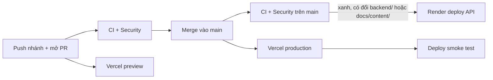

# Deploy: Vercel (frontend) + Render (backend), gói miễn phí

Bản production: <https://vgame.ai20k.cloud>.

Bản công khai chỉ có theme **town**. Theme khuôn viên lấy cảm hứng từ trường thật không được đưa lên
cho tới khi có phép của chủ thương hiệu (`frontend/scripts/build-vercel.mjs` mặc định
`VITE_THEME_PACKS=town`).

```text
Trình duyệt ──> vgame.ai20k.cloud (Vercel, trang tĩnh)
                   │  /api/*  (proxy, cùng origin)
                   └──> v-game-api.onrender.com (Render free, FastAPI)
```

## 1. Backend trên Render

1. Đăng nhập [render.com](https://render.com) bằng GitHub, cho Render quyền đọc repo `v-game`.
2. **New → Blueprint** → chọn repo. Render đọc `render.yaml` và tạo service `v-game-api`
   (gói free, vùng Singapore, health check `/api/health`).
3. Trong tab **Environment** của service, thêm `GEMINI_API_KEY` (key ở project Gemini không bật
   billing). Không có key thì trang web vẫn chạy, chỉ phần chạy agent trả 503 tiếng Việt.
4. Đợi deploy xong, mở `https://<tên-service>.onrender.com/api/health`, thấy `{"status":"ok"}` là được.

Ghi chú gói free: 512 MB RAM (API dùng khoảng 120 MB sau khởi động, khoảng 160 MB sau hàng trăm
lượt chạy, đo trên Windows; xem tab Metrics của Render một lần sau deploy để có số trên Linux),
0,1 CPU, ngủ sau 15 phút không có truy cập, thức dậy khoảng một phút. Trang chủ tự gọi
`/api/health` để đánh thức API sớm.

Muốn API không ngủ thì tạo một monitor HTTP 5 phút trên [UptimeRobot](https://uptimerobot.com) trỏ
vào `/api/health`, **chỉ khi `v-game-api` là web service free duy nhất trong workspace Render**: 750
giờ miễn phí tính cho cả workspace, một service thức cả tháng đã dùng khoảng 744 giờ, nên service
free khác trong cùng workspace (ví dụ Edico, Talent Hub) sẽ bị dừng giữa tháng. Có service khác thì
để API ngủ: seed đã làm các lượt phổ biến nhất sau khi thức không tốn lời gọi Gemini. API thức thì
bộ đếm `DAILY_LLM_CALL_CAP` và cache phát lại cũng giữ được cả ngày.

### Chạy agent thật trên gói free

- **Không có bước dựng index trên Render.** Index của 24 biến thể, vector câu hỏi và bảng điểm
  xếp hạng lại đã được tính sẵn bằng model thật trên máy dev và nằm trong code
  (`backend/src/vgame/engine/data`, khoảng 6,8 MB). API không nạp model ML nào, nên vừa 512 MB.
- **Lượt chạy có sẵn kết quả.** Lời giải mẫu và đồ thị khởi đầu của cả ba level đi kèm câu trả lời
  thật của Gemini (`replay-seed.json`). Chạy đồ thị khởi đầu chưa sửa không tốn lời gọi Gemini nào,
  kể cả khi hạn mức ngày đã hết; mỗi lượt như vậy tốn khoảng 2 giây trên 0,1 CPU.
  Lượt có đồ thị mới gọi Gemini thật, khoảng 10–20 giây.
- **`render.yaml` đã ghim:**
  - build `uv sync --frozen --no-dev --compile-bytecode`: không cài fastembed/onnxruntime (tải
    khoảng 41 MB thay vì 80 MB), có sẵn bytecode nên mỗi lần thức dậy khởi động nhanh hơn (đo trên
    máy dev: 1,8 giây CPU, tức khoảng 18 giây ở 0,1 CPU);
  - `MAX_CONCURRENT_RUNS=1`: người thứ hai nhận "Máy chủ miễn phí chạy một lượt mỗi lúc…";
  - `DAILY_LLM_CALL_CAP=200` (tạm, xem việc của chủ dự án bên dưới);
  - `OPENBLAS_NUM_THREADS=1`.
- **Hết lượt gọi AI:** người chơi thấy giờ mở lại theo giờ Việt Nam: 7 giờ sáng khi chạm
  `DAILY_LLM_CALL_CAP`, 14:00 (15:00 khi Mỹ hết giờ mùa hè) khi Google báo hết hạn mức ngày. Lượt có
  ca không được AI trả lời thì không tính sao, kể cả khi các ca khác đã có kết quả lưu sẵn.
- **Băng thông:** mỗi lượt chạy 30–97 KB (luồng SSE), mỗi lần mở level vài KB: 5 GB đủ cho hàng
  chục nghìn lượt.

Việc của chủ dự án:

1. Mở [AI Studio](https://aistudio.google.com) → hạn mức của key, đọc số lời gọi mỗi ngày (RPD) của
   `gemini-3.5-flash-lite`, `gemini-3.1-flash-lite`, `gemini-3.5-flash` (Google không công bố trên
   trang tài liệu), rồi đặt `DAILY_LLM_CALL_CAP` khoảng 80 % tổng trong tab Environment. Bộ đếm này
   về 0 mỗi khi Render ngủ hoặc khởi động lại, nên hạn mức của Google mới là trần cứng.
2. Sau khi sửa `docs/content`, câu hỏi golden hoặc file level: trên máy dev chạy
   `cd backend && uv run vgame-build-index` (cần khoảng 5 GB RAM; sửa một câu hỏi mất vài phút,
   dựng lại từ đầu 1–1,5 giờ), sinh lại seed nếu test `test_replay_seed.py` báo, rồi commit
   `backend/src/vgame/engine/data`. CI chặn nếu quên.

Thời tiết trên bản đồ lấy từ [Open-Meteo](https://open-meteo.com/): miễn phí, không cần key, chỉ dùng
phi thương mại, dữ liệu theo giấy phép CC BY 4.0 nên HUD ghi nguồn kèm link trong popover thời tiết.
Trình duyệt người xem gọi thẳng `api.open-meteo.com` (CSP `connect-src` có origin này) cho toạ độ
`place` của theme, 30 phút một lần khi tab đang hiện; popover ghi rằng Open-Meteo thấy IP người xem.
Backend không còn `/api/weather`: IP ra chung của Render free bị Open-Meteo trả 429 liên tục, còn mỗi
người xem có hạn mức theo IP của mình. Open-Meteo lỗi thì client im lặng thử lại sau 2 phút và giữ
cảnh theo giờ, nên bình minh, ban ngày, hoàng hôn, ban đêm vẫn đúng (trình duyệt tự tính theo đồng hồ
của mình), kể cả khi Render ngủ.

### Giữ Render ở mức 0 đồng

Render không có giới hạn chi tiêu. Workspace Hobby miễn phí gồm 750 giờ chạy máy free, 500 phút build
và 5 GB băng thông ra mỗi tháng; hết giờ chạy máy thì service tạm dừng tới tháng sau, còn phút build
và băng thông vượt mức thì bị tính tiền ($5 mỗi 1.000 phút build, $0,15 mỗi GB). `render.yaml` đã
chặn những gì cấu hình được:

- `plan: free`, không có ổ đĩa, database, cron job hay service thứ hai.
- Tắt môi trường xem trước cho pull request (`previews: generation: off`).
- Chỉ deploy commit đã qua CI (`autoDeployTrigger: checksPass`) và chỉ khi `backend/`,
  `docs/content/` hoặc `render.yaml` đổi (`buildFilter`), nên merge giao diện hay tài liệu không tốn
  phút build.

Phần làm trên dashboard (một lần):

1. **Workspace → Billing**: plan là **Hobby**. Nếu chưa thêm thẻ thì không thêm. Nếu đã có thẻ, ở mục
   giới hạn chi tiêu cho phút build (pipeline minutes) đặt mức vượt cho phép là **$0**, để vượt mức
   thì build dừng chứ không tính tiền.
2. **Service → Settings → Instance Type**: phải là **Free**. Đừng bấm Upgrade trên các thông báo
   "suspended".
3. **Workspace → Notifications**: bật email cảnh báo, và xem mục **Free usage** trong Billing mỗi
   tháng (giờ chạy máy, phút build, băng thông).
4. Không tạo thêm service, Postgres hay disk trong workspace này.

Mức dùng thực tế rất nhỏ: API trả JSON vài KB, một monitor ping 5 phút một lần chỉ khoảng 2 MB một
tháng, mỗi lần build khoảng 3–5 phút.

## 2. Frontend trên Vercel

1. Đăng nhập [vercel.com](https://vercel.com) bằng GitHub → **Add New → Project** → import `v-game`.
2. **Root Directory**: `frontend`. Framework preset: **Other** (đã khai báo trong `frontend/vercel.json`).
3. **Environment Variables**: `VG_API_ORIGIN` = `https://<tên-service>.onrender.com` (không có `/`
   ở cuối). Không cần đặt biến theme: mặc định chỉ build theme town.
4. Deploy. Build chạy `npm run build:vercel`: build như thường, rồi ghi `.vercel/output` với header
   bảo mật (CSP theo hash của từng bản build), proxy `/api/*` sang Render và SPA fallback.

## 3. Tên miền `vgame.ai20k.cloud` (đã chạy)

1. Vercel → Project → **Settings → Domains** → thêm `vgame.ai20k.cloud`.
2. Ở nơi quản lý DNS của `ai20k.cloud`, tạo bản ghi **CNAME**: tên `vgame`, giá trị đúng như Vercel
   hiển thị (thường là `cname.vercel-dns.com` hoặc một địa chỉ riêng của project).
3. Đợi Vercel báo "Valid Configuration"; chứng chỉ HTTPS được cấp tự động.

Không cần đổi CORS ở backend: trình duyệt chỉ gọi `vgame.ai20k.cloud/api/*`, Vercel chuyển tiếp
phía máy chủ.

## CI/CD: push là tự deploy



- **Mỗi PR:** GitHub Actions chạy CI (format, lint, type, unit, build, e2e, kiểm tên thương hiệu) và
  Security (gitleaks, semgrep, osv-scanner). Vercel dựng một bản preview riêng cho PR.
- **Merge vào `main`:** Vercel deploy production ngay. Render chỉ deploy API khi CI trên commit đó
  xanh và phần API có đổi (`render.yaml`).
- **Sau mỗi lần Vercel deploy production:** workflow `Deploy smoke test`
  (`.github/workflows/deploy-smoke.yml`) gọi trang thật: trang chủ, `/play`, header bảo mật, chỉ
  theme công khai được phục vụ, `/api/health` (chờ tối đa 4 phút cho API thức dậy) và `/api/zones`.
  Nó cũng chạy mỗi sáng 07:00 và chạy tay được (tab Actions → Deploy smoke test → Run workflow).
  Lỗi thì GitHub gửi email cho chủ repo.
- **Chặn production khi CI đỏ (làm một lần trên Vercel):** Project → **Settings → Deployment
  Checks** → thêm các check của GitHub Actions `Frontend checks`, `End-to-end tests` và
  `Brand isolation`. Vercel giữ bản production lại, chỉ gắn vào tên miền khi các check đó xanh.
  Nếu gói Hobby không có mục này thì luồng vẫn chạy, chỉ là Vercel deploy song song với CI.
- **Smoke test gọi tên miền thật:** đặt biến repo `PRODUCTION_URL` (GitHub → Settings → Secrets and
  variables → Actions → Variables) thành `https://vgame.ai20k.cloud`; không đặt thì smoke test dùng
  mặc định `https://v-game-theta.vercel.app` (vẫn trỏ tới cùng bản deploy).
- **Quay lại bản trước:** Vercel → Deployments → **Instant Rollback**; Render → service →
  Events → chọn bản deploy cũ → **Rollback**.

## Cập nhật

Merge vào `main` thì Vercel tự deploy lại; Render chỉ deploy khi CI xanh và phần API đổi (xem mục "Giữ Render ở mức 0 đồng"). Thử bản Vercel trên máy:

```bash
cd frontend && VG_API_ORIGIN=https://example.onrender.com npm run build:vercel
```
