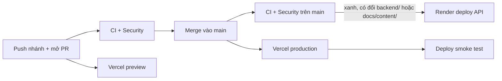

# Deploy: Vercel (frontend) + Render (backend), gói miễn phí

Bản công khai chỉ có theme **town**. Theme khuôn viên lấy cảm hứng từ trường thật không được đưa lên
cho tới khi có phép của chủ thương hiệu (`frontend/scripts/build-vercel.mjs` mặc định
`VITE_THEME_PACKS=town`).

```text
Trình duyệt ──> vgame.ai20k.cloud (Vercel, trang tĩnh)
                   │  /api/*  (proxy, cùng origin)
                   └──> v-game-api.onrender.com (Render free, FastAPI)
```

## 1. Backend trên Render

1. Đăng nhập [render.com](https://render.com) bằng GitHub, cho Render quyền đọc repo `v-game`.
2. **New → Blueprint** → chọn repo. Render đọc `render.yaml` và tạo service `v-game-api`
   (gói free, vùng Singapore, health check `/api/health`).
3. Trong tab **Environment** của service, thêm `GEMINI_API_KEY` (key ở project Gemini không bật
   billing). Chỉ cần khi chạy agent thật; trang web hiện tại chạy được không cần key.
4. Đợi deploy xong, mở `https://<tên-service>.onrender.com/api/health`, thấy `{"status":"ok"}` là được.

Ghi chú gói free: 512 MB RAM (API dùng khoảng 110 MB), ngủ sau 15 phút không có truy cập, thức dậy
khoảng một phút. Trang chủ tự gọi `/api/health` để đánh thức API sớm. Muốn API không ngủ thì tạo một
monitor HTTP 5 phút trên [UptimeRobot](https://uptimerobot.com) trỏ vào `/api/health` (một service
chạy cả tháng vẫn nằm trong 750 giờ miễn phí).

### Giữ Render ở mức 0 đồng

Render không có giới hạn chi tiêu. Workspace Hobby miễn phí gồm 750 giờ chạy máy free, 500 phút build
và 5 GB băng thông ra mỗi tháng; hết giờ chạy máy thì service tạm dừng tới tháng sau, còn phút build
và băng thông vượt mức thì bị tính tiền ($5 mỗi 1.000 phút build, $0,15 mỗi GB). `render.yaml` đã
chặn những gì cấu hình được:

- `plan: free`, không có ổ đĩa, database, cron job hay service thứ hai.
- Tắt môi trường xem trước cho pull request (`previews: generation: off`).
- Chỉ deploy commit đã qua CI (`autoDeployTrigger: checksPass`) và chỉ khi `backend/`,
  `docs/content/` hoặc `render.yaml` đổi (`buildFilter`), nên merge giao diện hay tài liệu không tốn
  phút build.

Phần làm trên dashboard (một lần):

1. **Workspace → Billing**: plan là **Hobby**. Nếu chưa thêm thẻ thì không thêm. Nếu đã có thẻ, ở mục
   giới hạn chi tiêu cho phút build (pipeline minutes) đặt mức vượt cho phép là **$0**, để vượt mức
   thì build dừng chứ không tính tiền.
2. **Service → Settings → Instance Type**: phải là **Free**. Đừng bấm Upgrade trên các thông báo
   "suspended".
3. **Workspace → Notifications**: bật email cảnh báo, và xem mục **Free usage** trong Billing mỗi
   tháng (giờ chạy máy, phút build, băng thông).
4. Không tạo thêm service, Postgres hay disk trong workspace này.

Mức dùng thực tế rất nhỏ: API trả JSON vài KB, một monitor ping 5 phút một lần chỉ khoảng 2 MB một
tháng, mỗi lần build khoảng 3–5 phút.

## 2. Frontend trên Vercel

1. Đăng nhập [vercel.com](https://vercel.com) bằng GitHub → **Add New → Project** → import `v-game`.
2. **Root Directory**: `frontend`. Framework preset: **Other** (đã khai báo trong `frontend/vercel.json`).
3. **Environment Variables**: `VG_API_ORIGIN` = `https://<tên-service>.onrender.com` (không có `/`
   ở cuối). Không cần đặt biến theme: mặc định chỉ build theme town.
4. Deploy. Build chạy `npm run build:vercel`: build như thường, rồi ghi `.vercel/output` với header
   bảo mật (CSP theo hash của từng bản build), proxy `/api/*` sang Render và SPA fallback.

## 3. Tên miền `vgame.ai20k.cloud`

1. Vercel → Project → **Settings → Domains** → thêm `vgame.ai20k.cloud`.
2. Ở nơi quản lý DNS của `ai20k.cloud`, tạo bản ghi **CNAME**: tên `vgame`, giá trị đúng như Vercel
   hiển thị (thường là `cname.vercel-dns.com` hoặc một địa chỉ riêng của project).
3. Đợi Vercel báo "Valid Configuration"; chứng chỉ HTTPS được cấp tự động.

Không cần đổi CORS ở backend: trình duyệt chỉ gọi `vgame.ai20k.cloud/api/*`, Vercel chuyển tiếp
phía máy chủ.

## CI/CD: push là tự deploy



- **Mỗi PR:** GitHub Actions chạy CI (format, lint, type, unit, build, e2e, kiểm tên thương hiệu) và
  Security (gitleaks, semgrep, osv-scanner). Vercel dựng một bản preview riêng cho PR.
- **Merge vào `main`:** Vercel deploy production ngay. Render chỉ deploy API khi CI trên commit đó
  xanh và phần API có đổi (`render.yaml`).
- **Sau mỗi lần Vercel deploy production:** workflow `Deploy smoke test`
  (`.github/workflows/deploy-smoke.yml`) gọi trang thật: trang chủ, `/play`, header bảo mật, chỉ
  theme công khai được phục vụ, `/api/health` (chờ tối đa 4 phút cho API thức dậy) và `/api/zones`.
  Nó cũng chạy mỗi sáng 07:00 và chạy tay được (tab Actions → Deploy smoke test → Run workflow).
  Lỗi thì GitHub gửi email cho chủ repo.
- **Chặn production khi CI đỏ (làm một lần trên Vercel):** Project → **Settings → Deployment
  Checks** → thêm các check của GitHub Actions `Frontend checks`, `End-to-end tests` và
  `Brand isolation`. Vercel giữ bản production lại, chỉ gắn vào tên miền khi các check đó xanh.
  Nếu gói Hobby không có mục này thì luồng vẫn chạy, chỉ là Vercel deploy song song với CI.
- **Khi có tên miền riêng:** đặt biến repo `PRODUCTION_URL` (GitHub → Settings → Secrets and
  variables → Actions → Variables) thành `https://vgame.ai20k.cloud`; mặc định smoke test dùng
  `https://v-game-theta.vercel.app`.
- **Quay lại bản trước:** Vercel → Deployments → **Instant Rollback**; Render → service →
  Events → chọn bản deploy cũ → **Rollback**.

## Cập nhật

Merge vào `main` thì Vercel tự deploy lại; Render chỉ deploy khi CI xanh và phần API đổi (xem mục "Giữ Render ở mức 0 đồng"). Thử bản Vercel trên máy:

```bash
cd frontend && VG_API_ORIGIN=https://example.onrender.com npm run build:vercel
```
